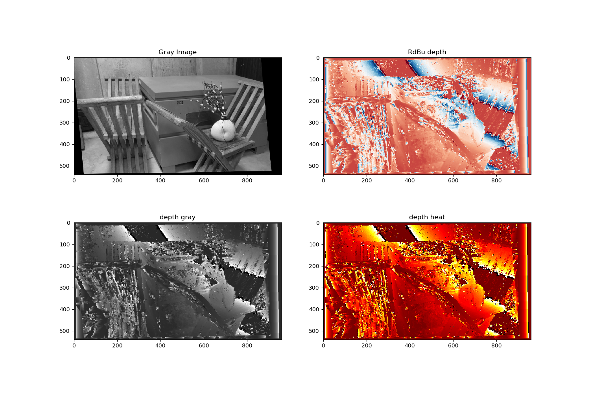
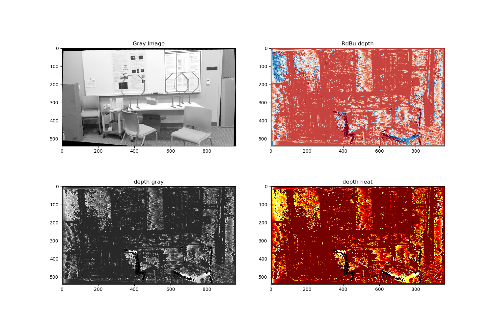

# Stereo_Depth_Estimation
Depth Estimation using Uncalibrated Stereo Camera

### Set up project:

    git clone https://github.com/aditiramadwar/Stereo_Depth_Estimation.git

### Run project
```
python3 main.py --set=1
```
choose from set 1-3

## Results
### Set 1


### Set 2


